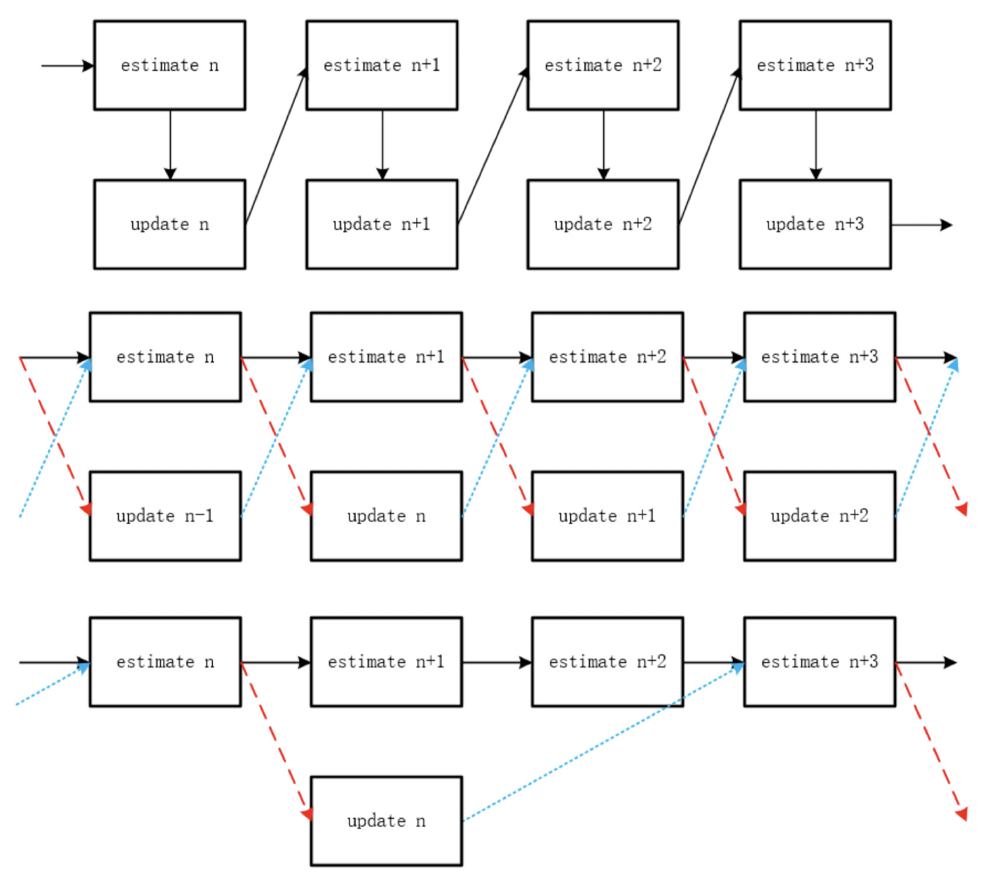

# FFTracker

### Summary

FFTracker is a real-time super fast object tracker, which is based on the correlation filter methods, running on a single CPU. It is written in pure C++ code and supports multiple platforms. FFTracker extends the CSRDCF algorithm which is proposed on CVPR 2017. It can provide better tracking results and runs faster. FFTracker can track any number of any kind objects in real time on a single CPU.

### Features

* Spatial mask constraint to reduce boundary effect.
* Channel weight constraint to distinguish the tracking power of different image features.
* 2D linear Kalman filter to smooth the motion trajectory.
* Real-time tracking quality evaluation system.
* Handle short-time occlusion as well as short-time severe deformation.
* Multiple learning rates fusion to keep short-term and long-term memory of the target object.
* Manual control of dymamic memory with the help of memory arena.
* Parallel computation.
* Precompute FFT and IFFT operation.
* Async-deferred filter updating strategy.
* RGB camera tracking and depth camera tracking support.
* Custom tracking driver for KinectV1, KinectV2 and RealSense device.

### Third-party dependency

* Eigen: used for complex matrix related operations such SVD and QR. Note, FFTracker has its own matrix processing system and necessary data structure.
* FFTW3: used for FFT and IFFT operation. 
* Spdlog: used for the tracking system logging.
* Stb: used for image file loading and saving.
* KinectV1: used for tracking via KinectV1 camera.
* KinectV2: used for tracking via KinectV2 camera.
* Librealsense: used for tracking via RealSense camera.
* Dirent: provides Linux compatible Dirent interface for Microsoft Windows.

All these third-party dependencies are stored in the `ThridParty` folder. Windows and macOS precompiled binary files are provided.

### Role of OpenCV

OpenCV is not necessary for FFTracker. FFTracker has its own image processing system and geometry computation system. The core algorithm can run without the need of OpenCV. However, FFTracker can run faster with the help of OpenCV. The most important thing is image resampling operation. OpenCV provides a pretty fast image resampling operation which I think is more suitable for FFTracker than its own version. OpenCV support is turned on by default. If you do not want any OpenCV support, you can open file `Source/CSRT.h`, comment line 69 `#define WITH_OPENCV`, then everything will be fine. 

On the other hand, FFTracker provide several test cased and one easy to run demo. They need OpenCV to retrieve camera data and show some GUI on your screen. They has nothing to do with the core FFTracker algorithm.

 ### Code File Structure

* `ThirdParty` folder contains precompiled version of third party dependencies except OpenCV.
* `Source/Camera` folder contains depth camera support: KinectV1, KinectV2 and RealSense. Camera support is individual from the core FFTracker algorithm. You can use other kind of camera data retrieve method or write your own camera drivers.
* `Source/Core` folder contains the core FFTracker algorhtim realization.
* `Source/Utility` folder contains FFT/IFFT operation, custom image processing, custom geometry operation, memory arena and parallism computation framework. 
* `Source/Export` folder contains an easy to use interface for your own usage. You can compile the whole FFTracker algorithm into a library, use `Source/Export/CSRTracker.h` as the only one interface. However, I recommend you to direct use the source FFTracker code to do more  configuration and customization.
* `Run` folder provides an easy to run demo and several test cases. Note, the several test cases need a RealSense device or Kinect device. The `run.cpp` demo direct use use OpenCV to fetch your default RGB camera data. Please see the file comment for more details.

### Support Platforms

* macOS
* Windows 10

Note core FFTracker algorithm is written in pure C++ and can be runnable on any platform which own a standard C++ compiler. C++ 11 support is necessary. In general, you should compile OpenCV and FFTW3 by yourself on the target platform such as Android and iOS, then link these libraries when compile FFTracker. In addition, you should write your own code to fetch the device's camera data.

### How to Build

1. Prepare the OpenCV environment. On macOS, I recommend to use homebrew to install OpenCV. If you use Windows 10, then you need Visual Studio 2017 or Visual Studio 2019. I recommend to use Microsoft's vcpkg to install OpenCV.  
2. Just use CMake to compile the project. All thirdparty dependencies have already be configured. You should not meet any problem.
3. You can directly run the demo compiled from `run.cpp`, operation instructions are showed in it's comment. 
4. Now, you can tracker any object from your RGB camera.

### Note

* Baisc CSRDCF algorithm: Lukezic, Alan, et al. "Discriminative correlation filter with channel and spatial reliability." *Proceedings of the IEEE Conference on Computer Vision and Pattern Recognition*. 2017.
* Basic geometry process, memory arena and parallism framework are refered from: https://github.com/mmp/pbrt-v3.
* FFTracker's target is to track any object in real time on a single CPU. It should be faster and faster, and provides better and better tracking results. Welcome any contribution.

### What is Async-deferred Filter Updating Strategy

Dive into the process of tracking. The algorithm follows a common `estimate and update` pattern. It first evaluate the result of current frame base on the learned model. Then it use that result to update the learned model. Finally, it enters the next frame. To make it more clear, the algorithm use the updated model from last frame to estimate the result of current frame.

Relax the constraint, defer the update one frame, let the algorithm use the updated model from last last frame to estimate the result of current frame. Then the update section can run in the background, parallel with the estimation section, which brings huge speed improvement. 

Following three figures describe the system pipeline when the deferred frame are 0, 1, and 2.

